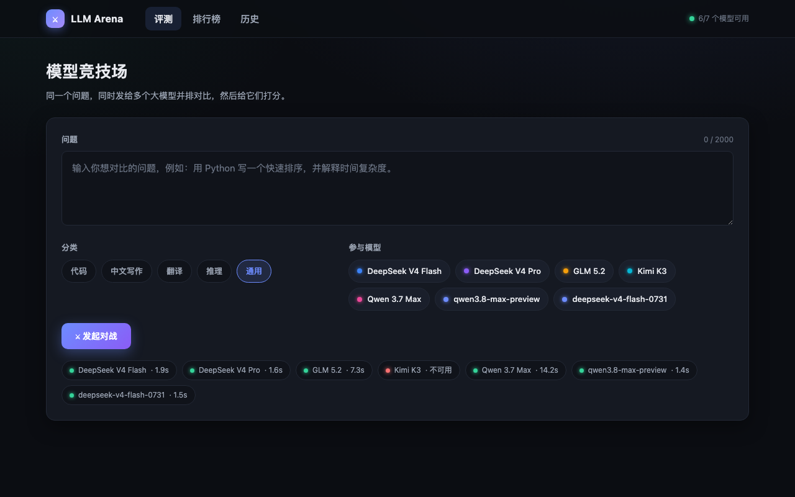
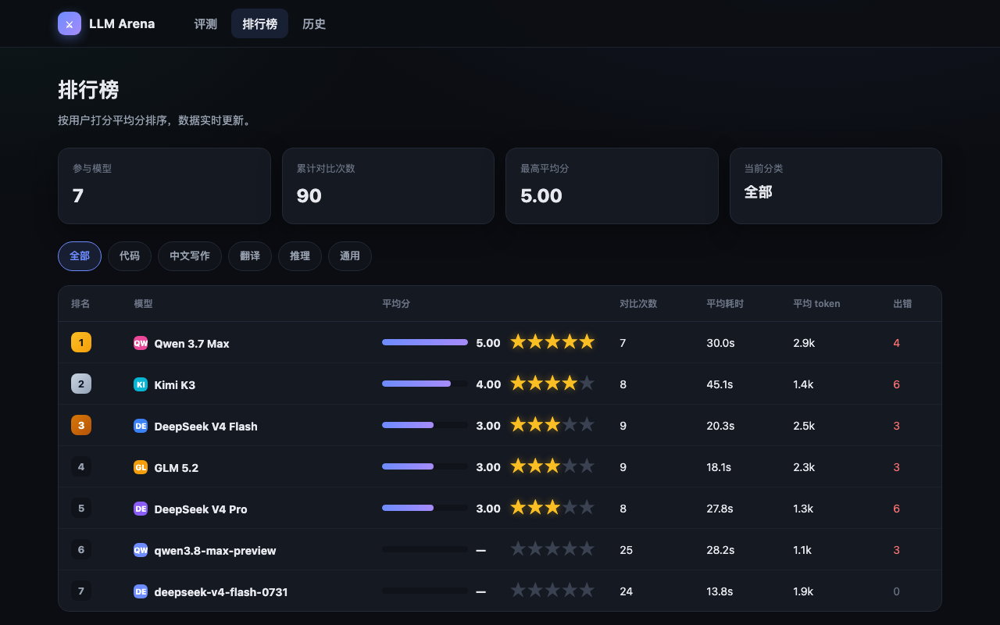
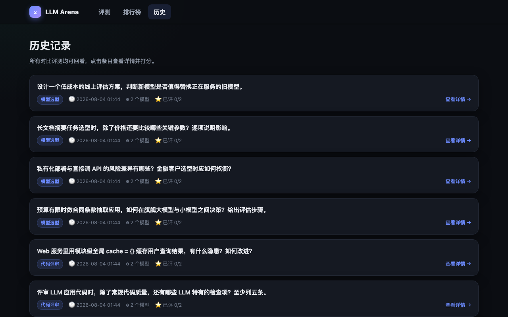

# ⚔️ LLM Arena · 模型竞技场

一个本地运行的 Web 应用：**输入一个问题，并发发送给多个大模型，并排对比回答，给它们打分，生成排行榜**。用于直观对比不同 LLM 的实际表现，也是「AI 应用开发能力 + 模型选型理解」的求职作品集项目。

> **一句话介绍**：本地并排评测多 LLM 的对战平台（FastAPI + SQLite + 零构建前端）；已评测 **63 题、181 条模型回答**，产出 2 份夜间对战报告（08-04 / 08-10，共 130 次真实模型调用）。

> 深色主题 · 零构建原生前端 · FastAPI + SQLite · OpenAI 兼容接口

## 关键指标（截至 2026-08-11）

| 指标 | 数值 | 数据来源 |
|---|---|---|
| 评测轮次（问题数） | **63**（2026-08-03 ~ 08-10） | `llm_arena.db` |
| 模型回答 | **181** 条 / 7 个模型 | `llm_arena.db` |
| 夜间批量对战 | 2 轮：08-04（20 题×2 模型）、08-10（30 题×3 模型） | `reports/*.md` |
| 对战模型调用 | **130** 次（08-04: 40 / 08-10: 90） | `reports/*.md` |
| 对战报告文件 | 2 份 MD + 2 组 results/answers JSON | `reports/` |
| 用户打分 | 8 条（1~5 星） | `llm_arena.db` ratings |
| 失败调用 | 27 / 181（含 qwen 上游 HTTP 500 如实记录） | `llm_arena.db` answers |

---

## 功能特性

| 功能 | 说明 |
| --- | --- |
| ⚔️ 对比评测 | 输入问题 → 多选模型（默认全选 5 个）→ 选择分类 → **并发**调用所有选中模型 |
| 🃏 结果卡片 | 每个模型一张卡：Markdown 渲染回答、耗时、token 数；单模型失败不影响其他，卡片显示错误原因 |
| 👁 双盲对决 | 结果默认**匿名**（模型 A/B/C + 卡片乱序）消除品牌偏见；选定两张卡片判定胜负，可随时"揭晓"模型名 |
| 🏆 Elo 排行榜 | pairwise 对决驱动 **Elo 评分**（K=32），与平均分互补：评分衡量绝对质量，Elo 衡量相对强弱 |
| ⭐ 打分 | 每个回答可点 1–5 星，可反复修改，实时入库 |
| 🗂 历史记录 | 所有评测可回看：问题、各模型回答、打分详情 |
| 💚 健康检查 | 页面展示每个模型 API 当前是否可用（加载时自动 ping，点击可刷新） |

---

## 技术架构

```
浏览器 (原生 HTML/CSS/JS, 零构建)
   │  fetch /api/*
   ▼
FastAPI (app.py) ──► llm_client.py ──► OpenAI 兼容 API (opencode.ai)
   │                        │            (asyncio.gather 并发, 单模型失败隔离)
   └──► database.py ──► SQLite (标准库 sqlite3, 无 ORM)
```

- **后端**：Python 3.11 + FastAPI，类型注解 + docstring
- **前端**：原生 HTML/CSS/JS 单页应用，无 React/Vue、无构建工具、无 CDN（离线可用）
- **数据库**：SQLite（python 标准库 `sqlite3`），每个函数独立短连接
- **LLM 调用**：OpenAI 兼容 `chat/completions`，`httpx.AsyncClient` + `asyncio.gather` 并发
- **Markdown**：自写最小渲染器（标题/粗体/行内码/代码块/列表/引用/链接/表格），先转义再渲染，防 XSS

## 目录结构

```
llm-arena/
├── app.py              # FastAPI 入口 + 全部路由
├── llm_client.py       # LLM 并发调用层（模型配置 / 并发对战 / 健康 ping）
├── database.py         # SQLite 建表 + 读写操作
├── static/
│   ├── index.html      # 评测页（核心）
│   ├── leaderboard.html# 排行榜页
│   ├── history.html    # 历史记录页
│   ├── css/style.css   # 全局深色主题样式
│   └── js/
│       ├── common.js   # 模型元信息 / API 封装 / 星标 / 回答卡片 / toast
│       └── markdown.js # 最小 Markdown 渲染器（离线）
├── requirements.txt
├── .env.example        # 环境变量模板（key 占位）
├── .gitignore          # 确保 .env / venv / *.db 永不提交
└── README.md
```

## 数据库设计

三张表（`database.py` 中建表）：

```sql
questions(id, text, category, created_at)          -- 一次评测的问题
answers  (id, question_id→questions, model, content,
          tokens, latency_ms, error, created_at)   -- 每个模型的回答
ratings  (id, answer_id→answers UNIQUE, score 1-5,
          created_at)                              -- 打分，answer_id 唯一可覆盖
```

## API 一览

| 方法 | 路径 | 说明 |
| --- | --- | --- |
| POST | `/api/battle` | `{question, category, models[]}` → 并发调用 → `question_id + answers[]` |
| POST | `/api/rate` | `{answer_id, score}` → 写入/覆盖评分 |
| GET | `/api/leaderboard?category=` | 排行数据（平均分倒序） |
| GET | `/api/history` | 评测历史列表 |
| GET | `/api/history/{id}` | 单次评测详情 |
| GET | `/api/models` | 可用模型与分类（静态配置，不暴露 key） |
| GET | `/api/health` | 并发 ping 各模型，返回可用状态 |

## 如何运行

### 1. 环境准备

```bash
cd ~/projects/llm-arena
python3 -m venv venv && source venv/bin/activate
pip install -r requirements.txt
```

### 2. 配置 API Key（安全红线）

Key 只从环境变量 `LLM_ARENA_API_KEY` 读取，**绝不写入代码/README/git**。

```bash
# 从本机密钥文件导出（示例路径，可按实际情况替换）
export LLM_ARENA_API_KEY=$(grep -o 'OPENCODE_GO_API_KEY=.*' ~/.hermes/.env | cut -d= -f2)
```

### 3. 配置代理（本机访问 opencode.ai 需走 ClashX）

```bash
export HTTPS_PROXY=http://127.0.0.1:7890 HTTP_PROXY=http://127.0.0.1:7890
```

> 应用代码不硬编码代理；`httpx` 自动尊重 `HTTPS_PROXY` 环境变量。若你的网络可直连，跳过此步即可。

### 4. 启动

```bash
uvicorn app:app --host 127.0.0.1 --port 8000
```

打开浏览器访问 **http://127.0.0.1:8000**。

### 5. 快速验收（可选）

```bash
bash scripts/acceptance_test.sh   # 需先完成步骤 2、3
```

该脚本会真实发起一次 3 模型对比评测、打分，并校验排行榜与历史接口，全部通过后打印 `ACCEPTANCE PASSED`。

---

## 可用模型

同一个 key 均可调用（`llm_client.py` 中静态配置，各模型给独立强调色）。**按角色分两档，这是本项目的模型选型框架：**

| 角色 | 模型 id | 名称 | 特点 |
| --- | --- | --- | --- |
| 🏭 **生产默认** | `deepseek-v4-flash` | DeepSeek V4 Flash | 快速、便宜、稳定，适合日常高并发生产场景 |
| 🧠 **复杂推理** | `deepseek-v4-pro` | DeepSeek V4 Pro | 深度推理、代码分析强，适合复杂 Agent 任务 |
| ⚖️ **对比基准** | `glm-5.2` | GLM 5.2 | 通用能力均衡（benchmark 参照系） |
| ⚖️ **对比基准** | `kimi-k3` | Kimi K3 | 长文本、中文友好（该模型仅接受 `temperature=1`） |
| ⚖️ **对比基准** | `qwen3.7-max` | Qwen 3.7 Max | 千问旗舰，综合最强（benchmark 参照系） |
| 🚀 **国内直连** | `deepseek-v4-flash-0731` | DeepSeek V4 Flash · 直连 | 阿里云 token-plan 通道，代理挂了也能用 |
| 🚀 **国内直连** | `qwen3.8-max-preview` | Qwen 3.8 Max · 直连 | 阿里云直连通道备选 |

> 技术细节：不同模型对采样参数要求不同（例如 kimi-k3 拒绝非 1 的 temperature），故温度在模型配置中按需设置，`llm_client.py` 据此构造请求。

## 界面截图







## 面试要点

**模型选型怎么做的？**
生产场景按「成本 × 时延 × 能力」分档：日常高并发（客服/自动回复/批量分析）用 `deepseek-v4-flash`——便宜快，单次调用成本低一个数量级；复杂推理（长代码分析、深度核验）用 `deepseek-v4-pro`。选型前先跑基准：本项目 63 题 × 7 模型的对战数据就是选型依据，不是拍脑袋。

**为什么用并发？**
`asyncio.gather` 同时发起最多 5 个请求，互不阻塞；实测 5 模型对比一次约 40–60s，串行会慢 5 倍。

**单模型失败如何隔离？**
`llm_client._call_one` 内部捕获一切异常，返回 `error` 字段；`battle` 用 `gather` 汇聚结果，失败模型在卡片上显示错误原因，其余回答不受影响。

**为什么选 SQLite + 标准库？**
零依赖、单文件、够用。演示/作品集场景不需要上 PostgreSQL；无 ORM 让数据流（建表 → 写入 → 聚合查询）一目了然，也展示对 SQL 的直接掌握。

**排行榜如何聚合？**
一条 `LEFT JOIN ratings` 的 GROUP BY SQL：`AVG(score)` 算平均分、`COUNT(DISTINCT question_id)` 算对比次数、`AVG(latency_ms)` 算平均耗时，`ORDER BY avg_score DESC NULLS LAST` 处理未打分模型。

**安全怎么考虑？**
- API Key 只从环境变量读，`.gitignore` 排除 `.env`、`venv/`、`*.db`，commit 历史里不落 key。
- 前端渲染先 HTML 转义再套 Markdown，避免模型输出注入脚本（XSS）。
- **可选管理鉴权**：设置环境变量 `LLM_ARENA_ADMIN_TOKEN` 后，所有 `/api/*` 需携带 `X-Admin-Token` 请求头，否则返回 403。默认不设置（本地免鉴权），**仅在把服务暴露到局域网/公网时启用**。

## 已知限制 / 后续方向

- Markdown 渲染器覆盖常用语法，复杂表格/嵌套列表可能有简化（够用且离线）。
- 打分是匿名主观分，未做多用户隔离；如需多用户可给 `ratings` 加 `user` 字段。
- 评测耗时受上游与代理网络影响，健康检查能反映但无法根治。
- 后续可加：更多模型、流式输出（SSE）、自定义 system prompt、导出报告。

## 许可证 / 说明

本地学习演示项目。API Key 为个人配置，请勿提交到任何公开仓库。
